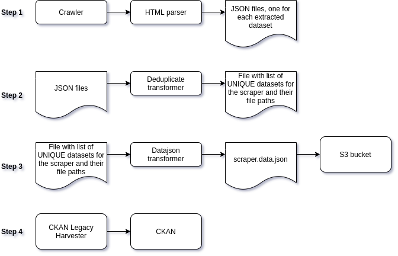
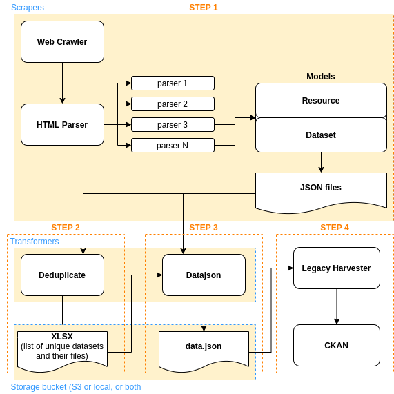
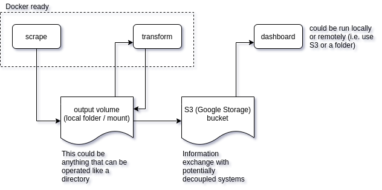

# Architectural Design for the Scraping Toolkit

This document provides a summary of the design approach/philosophy behind the scraping toolkit.
It gives you an overview of how all components in this kit fit together.

## Process diagram

The diagram below outlines the process flow of the 4 manual steps needed to initiate a crawler to getting the output into CKAN.

<cite>process diagram for scraping toolkit</cite>

## Architecture Diagram

The diagram below showcases the architectural overview of the scraping toolkit. 
Also represented is an example of a system that can utilise the final outputted file(s) from the scraping toolkit (i.e. a CKAN portal via the CKAN harvester)

<cite>architecture diagram for scraping toolkit</cite>

## Docker Container Architecture Design

The diagram below represents the scraping kit architecture from a Docker container perspective

<cite>architecture diagram for scraping toolkit (docker container perspective)</cite>